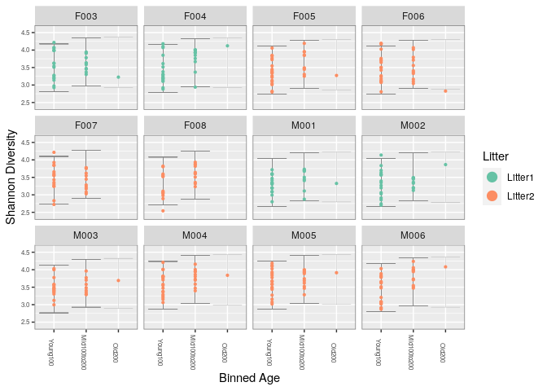

phyloseq\_tuto\_EL\_KHATI\_HAMZA
================

  - [Loading the data](#loading-the-data)
  - [Taxonomic Filtering](#taxonomic-filtering)
  - [Prevalence Filtering](#prevalence-filtering)
  - [Agglomerate taxa](#agglomerate-taxa)
  - [Abundance value transformation](#abundance-value-transformation)
  - [Subset by taxonomy](#subset-by-taxonomy)
  - [Preprocessing](#preprocessing)
  - [Different Ordination
    Projections](#different-ordination-projections)
  - [PCA on ranks](#pca-on-ranks)
  - [Graph-based analyses](#graph-based-analyses)
      - [Creating and plotting graphs](#creating-and-plotting-graphs)
      - [Minimum Spanning Tree (MST)](#minimum-spanning-tree-mst)
      - [Nearest neighbors](#nearest-neighbors)
      - [Linear modeling](#linear-modeling)
      - [Hierarchical multiple testing](#hierarchical-multiple-testing)
  - [Multitable techniques](#multitable-techniques)
  - [Conlusions](#conlusions)

``` r
library(rmarkdown)
library(knitr)
```

\#Cette commande c’est pour liée les données de partie dada2 avec la
partie phyloseq

``` r
load("02_data-analysis-with-DADA2_FinalENV")
```

\#les commandes suivantes corresponds aux differentes library qui vont
etre utilisés dans l’objet phyloseq

``` r
packageVersion('phyloseq')
```

    ## [1] '1.34.0'

``` r
library(phyloseq)
```

``` r
library(ggplot2)
```

``` r
library(Biostrings)
```

    ## Loading required package: BiocGenerics

    ## Loading required package: parallel

    ## 
    ## Attaching package: 'BiocGenerics'

    ## The following objects are masked from 'package:parallel':
    ## 
    ##     clusterApply, clusterApplyLB, clusterCall, clusterEvalQ,
    ##     clusterExport, clusterMap, parApply, parCapply, parLapply,
    ##     parLapplyLB, parRapply, parSapply, parSapplyLB

    ## The following objects are masked from 'package:stats':
    ## 
    ##     IQR, mad, sd, var, xtabs

    ## The following objects are masked from 'package:base':
    ## 
    ##     anyDuplicated, append, as.data.frame, basename, cbind, colnames,
    ##     dirname, do.call, duplicated, eval, evalq, Filter, Find, get, grep,
    ##     grepl, intersect, is.unsorted, lapply, Map, mapply, match, mget,
    ##     order, paste, pmax, pmax.int, pmin, pmin.int, Position, rank,
    ##     rbind, Reduce, rownames, sapply, setdiff, sort, table, tapply,
    ##     union, unique, unsplit, which.max, which.min

    ## Loading required package: S4Vectors

    ## Loading required package: stats4

    ## 
    ## Attaching package: 'S4Vectors'

    ## The following object is masked from 'package:base':
    ## 
    ##     expand.grid

    ## Loading required package: IRanges

    ## 
    ## Attaching package: 'IRanges'

    ## The following object is masked from 'package:phyloseq':
    ## 
    ##     distance

    ## Loading required package: XVector

    ## 
    ## Attaching package: 'Biostrings'

    ## The following object is masked from 'package:base':
    ## 
    ##     strsplit

``` r
library("dada2")
```

    ## Loading required package: Rcpp

``` r
library(gridExtra)
```

    ## 
    ## Attaching package: 'gridExtra'

    ## The following object is masked from 'package:BiocGenerics':
    ## 
    ##     combine

``` r
samples.out <- rownames(seqtab.nochim)
subject <- sapply(strsplit(samples.out, "D"), `[`, 1)
gender <- substr(subject,1,1)
subject <- substr(subject,2,999)
day <- as.integer(sapply(strsplit(samples.out, "D"), `[`, 2))
samdf <- data.frame(Subject=subject, Gender=gender, Day=day)
samdf$When <- "Early"
samdf$When[samdf$Day>100] <- "Late"
rownames(samdf) <- samples.out
```

# Loading the data

``` r
ps_connect <-url("https://raw.githubusercontent.com/spholmes/F1000_workflow/master/data/ps.rds")
ps = readRDS(ps_connect)
ps
```

    ## phyloseq-class experiment-level object
    ## otu_table()   OTU Table:         [ 389 taxa and 360 samples ]
    ## sample_data() Sample Data:       [ 360 samples by 14 sample variables ]
    ## tax_table()   Taxonomy Table:    [ 389 taxa by 6 taxonomic ranks ]
    ## phy_tree()    Phylogenetic Tree: [ 389 tips and 387 internal nodes ]

\#Ce code vérifie que le phyloseq et gridExtra est bien chargé. readRDS
c’est lire un objet phyloseq à partir d’une table que l’on a téléchargé.
Le ps\_connect est un fichier que l’on télécharge au cas où l’on
arriverait pas à faire les commandes. Le jeu de données est inspecté et
la taxonomie regardée. On va donc regarder les différents rangs
taxonomiques de la table ps.

# Taxonomic Filtering

``` r
# Show available ranks in the dataset
rank_names(ps)
```

    ## [1] "Kingdom" "Phylum"  "Class"   "Order"   "Family"  "Genus"

\#par ce code on va compter dans la table tax-table combien de fois on
trouve chacun des phylum et on va extraire les NULL c-à-d ceux qui n’ont
pas de phylum.

``` r
# Create table, number of features for each phyla
table(tax_table(ps)[, "Phylum"], exclude = NULL)
```

    ## 
    ##              Actinobacteria               Bacteroidetes 
    ##                          13                          23 
    ## Candidatus_Saccharibacteria   Cyanobacteria/Chloroplast 
    ##                           1                           4 
    ##         Deinococcus-Thermus                  Firmicutes 
    ##                           1                         327 
    ##                Fusobacteria              Proteobacteria 
    ##                           1                          11 
    ##                 Tenericutes             Verrucomicrobia 
    ##                           1                           1 
    ##                        <NA> 
    ##                           6

\#Un subset de ps est fait pour lequel le phylum n’est pas NA. Par
ailleurs, phylum n’est pas dans le vecteur ‘uncharacterized’. \#ce code
va enlever ceux qui n’ont pas d’annotation taxonomique au niveau du
phylum.

``` r
ps <- subset_taxa(ps, !is.na(Phylum) & !Phylum %in% c("", "uncharacterized"))
```

\#Ensuite,le nombre d’échantillon dans lequel un taxa apparait au moins
une fois, ou bien la prévalence des taxa.

``` r
# Compute prevalence of each feature, store as data.frame
prevdf = apply(X = otu_table(ps),
               MARGIN = ifelse(taxa_are_rows(ps), yes = 1, no = 2),
               FUN = function(x){sum(x > 0)})
# Add taxonomy and total read counts to this data.frame
prevdf = data.frame(Prevalence = prevdf,
                    TotalAbundance = taxa_sums(ps),
                    tax_table(ps))
```

\#prevdf montre la prévalence donc le nombre d’échantillons dans
lesquelles la séquence est trouvée, le nombre de séquence et la
taxonomie. Ensuite on fabrique une table avec cbind (mettre cote à cote
deux vecteur avec les prévalence et la somme des prévalences). \#les
résultats: La première colonne représente la moyenne des prévalences :
mean(df1\(Prevalence), et la deuxième c’est la somme:sum(df1\)Prevalence),
Il y a 52 échantillons de Deinococcus. Fusobacteria, elle, n’est que
dans deux échantillons. En moyenne il y a 52 Deinococcus par échantillon
et la somme c’est dans 52 échantillons.

``` r
plyr::ddply(prevdf, "Phylum", function(df1){cbind(mean(df1$Prevalence),sum(df1$Prevalence))})
```

    ##                         Phylum         1     2
    ## 1               Actinobacteria 120.15385  1562
    ## 2                Bacteroidetes 265.52174  6107
    ## 3  Candidatus_Saccharibacteria 280.00000   280
    ## 4    Cyanobacteria/Chloroplast  64.25000   257
    ## 5          Deinococcus-Thermus  52.00000    52
    ## 6                   Firmicutes 179.24771 58614
    ## 7                 Fusobacteria   2.00000     2
    ## 8               Proteobacteria  59.09091   650
    ## 9                  Tenericutes 234.00000   234
    ## 10             Verrucomicrobia 104.00000   104

\#suite aux résultats on va supprimé Fusobacteria car elle n’apparait
que dans deux échantillons au total. On va donc faire une filtration en
enlevant Fusobacteria et Deinococcus(qui represente que un peu plus de
1%).

``` r
# Define phyla to filter
filterPhyla = c("Fusobacteria", "Deinococcus-Thermus")
# Filter entries with unidentified Phylum.
ps1 = subset_taxa(ps, !Phylum %in% filterPhyla)
ps1
```

    ## phyloseq-class experiment-level object
    ## otu_table()   OTU Table:         [ 381 taxa and 360 samples ]
    ## sample_data() Sample Data:       [ 360 samples by 14 sample variables ]
    ## tax_table()   Taxonomy Table:    [ 381 taxa by 6 taxonomic ranks ]
    ## phy_tree()    Phylogenetic Tree: [ 381 tips and 379 internal nodes ]

# Prevalence Filtering

\#Ici on va faire un plot et AES qui montre les données de l’objet que
l’on va utiliser pour faire les plots (prévalence/nb échantillons dans
ps0 et total abondance). \#On colore par phylum. Après color=phylum.
\#on ajoute geomhline (ligne horizontale qui intercepte le y a plus de
0.05 (5%)). \#geompoint c’est la forme des point, Xlab et Ylab c’est le
titre des X et Y. Si on enlève facet-wrap, ça enlève tous les phyla qui
sont sur le même graph.

``` r
# Subset to the remaining phyla
prevdf1 = subset(prevdf, Phylum %in% get_taxa_unique(ps1, "Phylum"))
ggplot(prevdf1, aes(TotalAbundance, Prevalence / nsamples(ps),color=Phylum)) +
  # Include a guess for parameter
  geom_hline(yintercept = 0.05, alpha = 0.5, linetype = 2) +  geom_point(size = 2, alpha = 0.7) +
  scale_x_log10() +  xlab("Total Abundance") + ylab("Prevalence [Frac. Samples]") +
  facet_wrap(~Phylum) + theme(legend.position="none")
```

<!-- -->

\#il y a une grande abondande des firmicutes avec une prévalence qui
augmente en fonction de l’abondance, la prévalence augmente en fonction
de l’augmentation d’abondance des bactéries dans le milieu.

\#Chaque point montre une séquence (un ASV), la couleur du point montre
le phylum de l’ASV. Sur l’axe des Y c’est la prévalence et sur l’axe des
X c’est l’abondance de cet ASV dans le jeu de données. Un graph avec
tous les phylum réuni peut aussi être réalisé. \#La fonction facet-wrap
en fonction du phylum va faire un graph par phylum.

\#Ici on va calculer un seuil de prévalence à 5% et voir à combien
d’échantillon cela correspond.

``` r
# Define prevalence threshold as 5% of total samples
prevalenceThreshold = 0.05 * nsamples(ps)
prevalenceThreshold
```

    ## [1] 18

\#Avec le keeptaxa, les noms de lignes des prevdf1 avec prevdf1 a des
prévalence supérieures ou égal à 18 (seuil de prévalence) sont pris.

``` r
# Execute prevalence filter, using `prune_taxa()` function
keepTaxa = rownames(prevdf1)[(prevdf1$Prevalence >= prevalenceThreshold)]
ps2 = prune_taxa(keepTaxa, ps)
```

# Agglomerate taxa

\#ce code sert a regroupées les séquences par rang taxonomiques
identiques

``` r
# How many genera would be present after filtering?
length(get_taxa_unique(ps2, taxonomic.rank = "Genus"))
```

    ## [1] 49

\#On utilise le tax\_glom pour faire merger des séquences quelque soit
le rang, ici jusqu’au genre (taxnomic.rank), Il ne reste que 49
phylotypes sur les 384 ASV différents.

``` r
ps3 = tax_glom(ps2, "Genus", NArm = TRUE)
```

``` r
library(phangorn)
library(DECIPHER)
seqs <- getSequences(seqtab.nochim)
names(seqs) <- seqs # This propagates to the tip labels of the tree
alignment <- AlignSeqs(DNAStringSet(seqs), anchor=NA,verbose=FALSE)
phangAlign <- phyDat(as(alignment, "matrix"), type="DNA")
dm <- dist.ml(phangAlign)
treeNJ <- NJ(dm) # Note, tip order != sequence order
fit = pml(treeNJ, data=phangAlign)
fitGTR <- update(fit, k=4, inv=0.2)
fitGTR <- optim.pml(fitGTR, model="GTR", optInv=TRUE, optGamma=TRUE,
        rearrangement = "stochastic", control = pml.control(trace = 0))
detach("package:phangorn", unload=TRUE)
```

\#ici on met h= 0.4 et c’est la hauteur de la branche qui défini un
phylogénétype. c’est à dire toutes les longueurs de branches qui sont
inférieurs à 0.4 seront rassembler en ‘phyologénétypes’.

``` r
h1 = 0.4
ps4 = tip_glom(ps2, h = h1)
```

\#Plot\_tree est la fonction qui fait un graph d’un arbre. Dans phyloseq
on a un arbre.

``` r
multiPlotTitleTextSize = 15
p2tree = plot_tree(ps2, method = "treeonly",
                   ladderize = "left",
                   title = "Before Agglomeration") +
  theme(plot.title = element_text(size = multiPlotTitleTextSize))
p3tree = plot_tree(ps3, method = "treeonly",
                   ladderize = "left", title = "By Genus") +
  theme(plot.title = element_text(size = multiPlotTitleTextSize))
p4tree = plot_tree(ps4, method = "treeonly",
                   ladderize = "left", title = "By Height") +
  theme(plot.title = element_text(size = multiPlotTitleTextSize))
```

``` r
library("gridExtra")
```

\#Ici on a 3 arbres :1er construit avec phangorn avant agglomération :
on a les 384 ASV avec nos séquences ASV,2eme c’est ps3 avec les
phylotypes qui vont jusqu’au genre,la derniere c’est ps4 avec la
longueur qui s’arrête à 0.4.

``` r
grid.arrange(nrow = 1, p2tree, p3tree, p4tree)
```

<!-- -->

# Abundance value transformation

\#Ici on va faire plot d’abandance, et avec la fonction psmelt on va
comparer les différences échelles et de distribution des valeurs
d’abondances de l’objet phyloseq avant et après la transformation. On
va aussi faire le graphique en fonction du sexe de la souris (mâle ou
femelle).

``` r
plot_abundance = function(physeq,title = "",
                          Facet = "Order", Color = "Phylum"){
  # Arbitrary subset, based on Phylum, for plotting
  p1f = subset_taxa(physeq, Phylum %in% c("Firmicutes"))
  mphyseq = psmelt(p1f)
  mphyseq <- subset(mphyseq, Abundance > 0)
  ggplot(data = mphyseq, mapping = aes_string(x = "sex",y = "Abundance",
                              color = Color, fill = Color)) +
    geom_violin(fill = NA) +
    geom_point(size = 1, alpha = 0.3,
               position = position_jitter(width = 0.3)) +
    facet_wrap(facets = Facet) + scale_y_log10()+
    theme(legend.position="none")
}
```

\#avec la commande transform\_sample\_counts on va transformer les
échantillons en fréquence avec la proportion et l’abondance relative
dans un nouvaeu objet de ps3ra.

``` r
# Transform to relative abundance. Save as new object.
ps3ra = transform_sample_counts(ps3, function(x){x / sum(x)})
```

``` r
plotBefore = plot_abundance(ps3,"")
plotAfter = plot_abundance(ps3ra,"")
# Combine each plot into one graphic.
grid.arrange(nrow = 1,  plotBefore, plotAfter)
```

<!-- -->

\#Sur ces graph, on compare l’abondance avant (en haut) et l’abondance
relative après (en bas) sur 4 ordres différents en fonction du sexe. Il
est d’ailleurs possible de noter que pour les Lactobacillales, on peut
observer assez facilement une séparation nette entre deux groupements de
points (abundance relative aprés).

# Subset by taxonomy

\#Sur le graphique, on a l’abondance en fonction du sexe chez deux
familles présentes dans l’ordre des Lactobacillales. On peut voir qu’il
y a une distribution bimodale sur le graph avec les 4 ordres pour
Lactobacillale. Cette configuration est donc due aux deux genres
Lactobacillus et Streptococcus avec l’abondance relative de
Lactobacillus beaucoup plus importante par rapport au Streptococcus.

``` r
psOrd = subset_taxa(ps3ra, Order == "Lactobacillales")
plot_abundance(psOrd, Facet = "Genus", Color = NULL)
```

<!-- -->

``` r
.cran_packages <- c( "shiny","miniUI", "caret", "pls", "e1071", "ggplot2", "randomForest", "dplyr", "ggrepel", "nlme", "devtools",
                  "reshape2", "PMA", "structSSI", "ade4",
                  "ggnetwork", "intergraph", "scales")
.github_packages <- c("jfukuyama/phyloseqGraphTest")
.bioc_packages <- c("genefilter", "impute")
```

``` r
install.packages(.cran_packages)
devtools::install_github(.github_packages)
BiocManager::install(.bioc_packages)
```

# Preprocessing

\#Ce graph s’applique sur sample data de ps en fonction de l’âge. C’est
donc la distribution des âges. L’histogramme fait des ‘bin’ donc des
catégories des âges. Le premier graph représente le nombre
d’échantillon présent dans chaque classe d’âge. On voit trois grands
groupes d’échantillons plutôt que d’avoir une variable continue
catégorielle, on peut avoir trois classes (early, mid et late)
respectivement.

``` r
qplot(sample_data(ps)$age, geom = "histogram",binwidth=20) + xlab("age")
```

<!-- -->

\#Le deuxième graph prend le nombre de chaque OTU présentes dans chaque
échantillons est le multiplie par un log 10. Le graph montre le log du
nombre de séquence par échantillon en fonction du nombre d’échantillons.

``` r
qplot(log10(rowSums(otu_table(ps))),binwidth=0.2) +
  xlab("Logged counts-per-sample")
```

<!-- -->

\#Des transforations de ps sont faites en utilisant la fonction X avec
log(1 + x)). Avec la table de métadonnées de pslog, on crée un nouvelle
catégorie avec l’âge en le découpant de 0, 100, 200 et 400 avec breaks.
On définit une autre variable qui est une ordination avec un indice de
distance wunifrac avec un indice de béta diversité. Il mesure la
distance entre les échantillons et pondère en fonction de la distance
phylogénétique entre les ASV.

``` r
sample_data(ps)$age_binned <- cut(sample_data(ps)$age,
                          breaks = c(0, 100, 200, 400))
levels(sample_data(ps)$age_binned) <- list(Young100="(0,100]", Mid100to200="(100,200]", Old200="(200,400]")
sample_data(ps)$family_relationship=gsub(" ","",sample_data(ps)$family_relationship)
pslog <- transform_sample_counts(ps, function(x) log(1 + x))
out.wuf.log <- ordinate(pslog, method = "MDS", distance = "wunifrac")
```

    ## Warning in UniFrac(physeq, weighted = TRUE, ...): Randomly assigning root as --
    ## GCGAGCGTTATCCGGATTTATTGGGTTTAAAGGGTGCGTAGGCGGGATGCCAAGTCAGCGGTAAAAATGCGGTGCTCAACGCCGTCGAGCCGTTGAAACTGGCGTTCTTGAGTGGGCGAGAAGTATGCGGAATGCGTGGTGTAGCGGTGAAATGCATAGATATCACGCAGAACTCCGATTGCGAAGGCAGCATACCGGCGCCCTACTGACGCTGAGGCACGAAAGCGTGGGTATC
    ## -- in the phylogenetic tree in the data you provided.

``` r
evals <- out.wuf.log$values$Eigenvalues
plot_ordination(pslog, out.wuf.log, color = "age_binned") +
  labs(col = "Binned Age") +
  coord_fixed(sqrt(evals[2] / evals[1]))
```

<!-- -->
\#On observe une PCoA avec les échantillons colorés par classe d’âge,
l’axe 2 représente en partie la différence d’âge. Les points
correspondent au échantillons. Il s’agit d’une ordination. Il y a un
gradient avec les plus agés qui sont vers le haut.

``` r
rel_abund <- t(apply(otu_table(ps), 1, function(x) x / sum(x)))
qplot(rel_abund[, 12], geom = "histogram",binwidth=0.05) +
  xlab("Relative abundance")
```

<!-- -->
\#code en haut: Les abondances relatives sont calculées pour chacun des
ASV en prenant le nombre d’observation de chaque ASV et en divisant par
la ligne total function(x) x / sum(x) (on transforme des comptages en
pourcentage).

# Different Ordination Projections

``` r
outliers <- c("F5D165", "F6D165", "M3D175", "M4D175", "M5D175", "M6D175")
ps <- prune_samples(!(sample_names(ps) %in% outliers), ps)
```

``` r
which(!rowSums(otu_table(ps)) > 1000)
```

    ## F5D145 M1D149   M1D9 M2D125  M2D19 M3D148 M3D149   M3D3   M3D5   M3D8 
    ##     69    185    200    204    218    243    244    252    256    260

``` r
ps <- prune_samples(rowSums(otu_table(ps)) > 1000, ps)
pslog <- transform_sample_counts(ps, function(x) log(1 + x))
```

``` r
out.pcoa.log <- ordinate(pslog,  method = "MDS", distance = "bray")
evals <- out.pcoa.log$values[,1]
plot_ordination(pslog, out.pcoa.log, color = "age_binned",
                  shape = "family_relationship") +
  labs(col = "Binned Age", shape = "Litter")+
  coord_fixed(sqrt(evals[2] / evals[1]))
```

<!-- -->
\#d’aprés le graphe en haut il y a une forte proximité entre les
différentes données. Seules quelques données isolées sont présentes sur
le graphique. Il faut faire une double ordination en faisant une double
PCoA. La double ordinaiton permet de faire la dissimilarité entre les
espèces et la dissimilarité entre les communautés.

``` r
out.dpcoa.log <- ordinate(pslog, method = "DPCoA")
evals <- out.dpcoa.log$eig
plot_ordination(pslog, out.dpcoa.log, color = "age_binned", label= "SampleID",
                  shape = "family_relationship") +
  labs(col = "Binned Age", shape = "Litter")+
  coord_fixed(sqrt(evals[2] / evals[1]))
```

<!-- -->

\#graphe en haut: l’axe 2 représente l’âge avec une distinctions entre
les souris agés et jeunes.

\#Afin de pouvoir observer les abondances sur des données volumineuses,
des rangs sont créés pour faire une PCA. Une nouvelle matrice est créée
avec les abondances par rangs, où le microbe avec le plus petit
échantillon est mappé au rang 1, le deuxième rang au rang 2, etc.

\#Les positions des échantillons DPCoA(graphe précedent) peuvent être
interprétées par rapport aux coordonnées des espèces dans ce graph.donc
on peut rajouter pour le graphe precedent que les échantillons qui ont
un plus grand score sur cet axe, ont plus de taxa de Bactéroidetes et
une partie de Firmicutes.

``` r
plot_ordination(pslog, out.dpcoa.log, type = "species", color = "Phylum") +
  coord_fixed(sqrt(evals[2] / evals[1]))
```

<!-- -->

``` r
out.wuf.log <- ordinate(pslog, method = "PCoA", distance ="wunifrac")
```

    ## Warning in UniFrac(physeq, weighted = TRUE, ...): Randomly assigning root as --
    ## GCGAGCGTTGTCCGGAATCACTGGGCGTAAAGGGCGCGTAGGCGGTTTAATAAGTCAGTGGTGAAAACTGAGGGCTCAACCCTCAGCCTGCCACTGATACTGTTAGACTTGAGTATGGAAGAGGAGAATGGAATTCCTAGTGTAGCGGTGAAATGCGTAGATATTAGGAGGAACACCAGTGGCGAAGGCGATTCTCTGGGCCAAGACTGACGCTGAGGCGCGAAAGCGTGGGGAG
    ## -- in the phylogenetic tree in the data you provided.

``` r
evals <- out.wuf.log$values$Eigenvalues
plot_ordination(pslog, out.wuf.log, color = "age_binned",
                  shape = "family_relationship") +
  coord_fixed(sqrt(evals[2] / evals[1])) +
  labs(col = "Binned Age", shape = "Litter")
```

<!-- -->
\#Enfin, il est possible de regarder les résultats de PCoA avec Unifrac
pondéré. Une fois encore, le deuxième axe est plutôt associé à un effet
d’âge, donc c’est similaire au graphique de la DPCoA. Ces deux méthodes
d’ordination phylogénétique prennent en compte l’abondance. Cependant,
la DPCoA a donné une interprétation beaucoup plus nette du deuxième axe,
par rapport à Unifrac pondéré.

# PCA on ranks

\#Lorsque les bactéries sont rares ou peu présentes, un rang peut être
créé. Donc les bactéries présentes avec une abondance inférieure à un
certain seuil doivent être liées à 1. Ensuite les autres rangs sont
rétrogradés pour éviter un trop grand écart entre les rangs. C’est ce
qui est fait pour le prochain graphique.

``` r
abund <- otu_table(pslog)
abund_ranks <- t(apply(abund, 1, rank))
```

``` r
abund_ranks <- abund_ranks - 329
abund_ranks[abund_ranks < 1] <- 1
```

``` r
library(dplyr)
```

    ## 
    ## Attaching package: 'dplyr'

    ## The following object is masked from 'package:gridExtra':
    ## 
    ##     combine

    ## The following objects are masked from 'package:Biostrings':
    ## 
    ##     collapse, intersect, setdiff, setequal, union

    ## The following object is masked from 'package:XVector':
    ## 
    ##     slice

    ## The following objects are masked from 'package:IRanges':
    ## 
    ##     collapse, desc, intersect, setdiff, slice, union

    ## The following objects are masked from 'package:S4Vectors':
    ## 
    ##     first, intersect, rename, setdiff, setequal, union

    ## The following objects are masked from 'package:BiocGenerics':
    ## 
    ##     combine, intersect, setdiff, union

    ## The following objects are masked from 'package:stats':
    ## 
    ##     filter, lag

    ## The following objects are masked from 'package:base':
    ## 
    ##     intersect, setdiff, setequal, union

``` r
library(reshape2)
abund_df <- melt(abund, value.name = "abund") %>%
  left_join(melt(abund_ranks, value.name = "rank"))
```

    ## Joining, by = c("Var1", "Var2")

``` r
colnames(abund_df) <- c("sample", "seq", "abund", "rank")

abund_df <- melt(abund, value.name = "abund") %>%
  left_join(melt(abund_ranks, value.name = "rank"))
```

    ## Joining, by = c("Var1", "Var2")

``` r
colnames(abund_df) <- c("sample", "seq", "abund", "rank")

sample_ix <- sample(1:nrow(abund_df), 8)
ggplot(abund_df %>%
         filter(sample %in% abund_df$sample[sample_ix])) +
  geom_point(aes(x = abund, y = rank, col = sample),
             position = position_jitter(width = 0.2), size = 1.5) +
  labs(x = "Abundance", y = "Thresholded rank") +
 scale_color_brewer(palette = "Set2")
```

<!-- -->
\# maintenant on peut effectuer une PCA et étudier le biplot résultant,
donné dans la figure ci-dessous. Pour produire une annotation pour cette
figure, nous avons utilisé le bloc suivant.

``` r
library(ade4)
```

    ## 
    ## Attaching package: 'ade4'

    ## The following object is masked from 'package:Biostrings':
    ## 
    ##     score

    ## The following object is masked from 'package:BiocGenerics':
    ## 
    ##     score

``` r
ranks_pca <- dudi.pca(abund_ranks, scannf = F, nf = 3)
row_scores <- data.frame(li = ranks_pca$li,
                         SampleID = rownames(abund_ranks))
col_scores <- data.frame(co = ranks_pca$co,
                         seq = colnames(abund_ranks))
tax <- tax_table(ps) %>%
  data.frame(stringsAsFactors = FALSE)
tax$seq <- rownames(tax)
main_orders <- c("Clostridiales", "Bacteroidales", "Lactobacillales",
                 "Coriobacteriales")
tax$Order[!(tax$Order %in% main_orders)] <- "Other"
tax$Order <- factor(tax$Order, levels = c(main_orders, "Other"))
tax$otu_id <- seq_len(ncol(otu_table(ps)))
row_scores <- row_scores %>%
  left_join(sample_data(pslog))
```

    ## Joining, by = "SampleID"

``` r
col_scores <- col_scores %>%
  left_join(tax)
```

    ## Joining, by = "seq"

``` r
evals_prop <- 100 * (ranks_pca$eig / sum(ranks_pca$eig))
ggplot() +
  geom_point(data = row_scores, aes(x = li.Axis1, y = li.Axis2), shape = 2) +
  geom_point(data = col_scores, aes(x = 25 * co.Comp1, y = 25 * co.Comp2, col = Order),
             size = .3, alpha = 0.6) +
  scale_color_brewer(palette = "Set2") +
  facet_grid(~ age_binned) +
  guides(col = guide_legend(override.aes = list(size = 3))) +
  labs(x = sprintf("Axis1 [%s%% variance]", round(evals_prop[1], 2)),
       y = sprintf("Axis2 [%s%% variance]", round(evals_prop[2], 2))) +
  coord_fixed(sqrt(ranks_pca$eig[2] / ranks_pca$eig[1])) +
  theme(panel.border = element_rect(color = "#787878", fill = alpha("white", 0)))
```

<!-- -->
\# Canonical correspondence

\#CCpnA permet de créer des biplots où les positions des échantillons
sont déterminées par la similitude des signatures d’espèces et des
caractéristiques environnementales. dont le but de la création de
biplots est de déterminer quels types de communautés bactériennes sont
les plus importants dans différents types d’échantillons de souris.

``` r
ps_ccpna <- ordinate(pslog, "CCA", formula = pslog ~ age_binned + family_relationship)
```

``` r
library(ggrepel)
ps_scores <- vegan::scores(ps_ccpna)
sites <- data.frame(ps_scores$sites)
sites$SampleID <- rownames(sites)
sites <- sites %>%
  left_join(sample_data(ps))
```

    ## Joining, by = "SampleID"

    ## Warning in class(x) <- c(setdiff(subclass, tibble_class), tibble_class): Setting
    ## class(x) to multiple strings ("tbl_df", "tbl", ...); result will no longer be an
    ## S4 object

``` r
species <- data.frame(ps_scores$species)
species$otu_id <- seq_along(colnames(otu_table(ps)))
species <- species %>%
  left_join(tax)
```

    ## Joining, by = "otu_id"

``` r
evals_prop <- 100 * ps_ccpna$CCA$eig[1:2] / sum(ps_ccpna$CA$eig)
ggplot() +
  geom_point(data = sites, aes(x = CCA1, y = CCA2), shape = 2, alpha = 0.5) +
  geom_point(data = species, aes(x = CCA1, y = CCA2, col = Order), size = 0.5) +
  geom_text_repel(data = species %>% filter(CCA2 < -2),
                    aes(x = CCA1, y = CCA2, label = otu_id),
            size = 1.5, segment.size = 0.1) +
  facet_grid(. ~ family_relationship) +
  guides(col = guide_legend(override.aes = list(size = 3))) +
  labs(x = sprintf("Axis1 [%s%% variance]", round(evals_prop[1], 2)),
        y = sprintf("Axis2 [%s%% variance]", round(evals_prop[2], 2))) +
  scale_color_brewer(palette = "Set2") +
  coord_fixed(sqrt(ps_ccpna$CCA$eig[2] / ps_ccpna$CCA$eig[1])*0.45   ) +
  theme(panel.border = element_rect(color = "#787878", fill = alpha("white", 0)))
```

<!-- -->
\# Supervised learning

\#On va donner une partie des données avec une classification. Cette
classification ici est la classe d’âge (0 100 et 100 400). Après on fait
apprendre à la machine : la table d’observation et la métadonnée âge
pour être capable de pour déterminer l’âge à l’aide de la table
d’observation avec le jeu de données. On peut vérifier si l’algorithme
de machine learning a été efficace pour apprendre.

``` r
library(caret)
sample_data(pslog)$age2 <- cut(sample_data(pslog)$age, c(0, 100, 400))
dataMatrix <- data.frame(age = sample_data(pslog)$age2, otu_table(pslog))
# take 8 mice at random to be the training set, and the remaining 4 the test set
trainingMice <- sample(unique(sample_data(pslog)$host_subject_id), size = 8)
inTrain <- which(sample_data(pslog)$host_subject_id %in% trainingMice)
training <- dataMatrix[inTrain,]
testing <- dataMatrix[-inTrain,]
plsFit <- train(age ~ ., data = training,
                method = "pls", preProc = "center")
```

``` r
plsClasses <- predict(plsFit, newdata = testing)
table(plsClasses, testing$age)
```

    ##            
    ## plsClasses  (0,100] (100,400]
    ##   (0,100]        64         0
    ##   (100,400]       5        43

\#On a donc le nombre de fois où les souris sont entre 0 100 et 100 400.
On a un mécanisme d’apprentissage machine qui permet de faire de la
classification a posteriori. On donne juste un sous ensemble à la
machine. Une autre méthode est d’utiliser rf ajusté à pls. Néanmoins
avec cette méthode, plus de souris âgées sont classées comme étant
jeunes.

``` r
library(randomForest)
```

    ## randomForest 4.6-14

    ## Type rfNews() to see new features/changes/bug fixes.

    ## 
    ## Attaching package: 'randomForest'

    ## The following object is masked from 'package:dplyr':
    ## 
    ##     combine

    ## The following object is masked from 'package:gridExtra':
    ## 
    ##     combine

    ## The following object is masked from 'package:BiocGenerics':
    ## 
    ##     combine

    ## The following object is masked from 'package:ggplot2':
    ## 
    ##     margin

``` r
rfFit <- train(age ~ ., data = training, method = "rf",
               preProc = "center", proximity = TRUE)
rfClasses <- predict(rfFit, newdata = testing)
table(rfClasses, testing$age)
```

    ##            
    ## rfClasses   (0,100] (100,400]
    ##   (0,100]        66         2
    ##   (100,400]       3        41

\#A ce niveau on peut ensuite faire un biplot PLS en récupérant les
résultats obtenus.

``` r
library(vegan)
pls_biplot <- list("loadings" = loadings(plsFit$finalModel),
                   "scores" = scores(plsFit$finalModel))
class(pls_biplot$scores) <- "matrix"

pls_biplot$scores <- data.frame(sample_data(pslog)[inTrain, ],
                                pls_biplot$scores)

tax <- tax_table(ps)@.Data %>%
  data.frame(stringsAsFactors = FALSE)
main_orders <- c("Clostridiales", "Bacteroidales", "Lactobacillales",
                 "Coriobacteriales")
tax$Order[!(tax$Order %in% main_orders)] <- "Other"
tax$Order <- factor(tax$Order, levels = c(main_orders, "Other"))
class(pls_biplot$loadings) <- "matrix"
pls_biplot$loadings <- data.frame(tax, pls_biplot$loadings)
```

``` r
ggplot() +
  geom_point(data = pls_biplot$scores,
             aes(x = Comp.1, y = Comp.2), shape = 2) +
  geom_point(data = pls_biplot$loadings,
             aes(x = 25 * Comp.1, y = 25 * Comp.2, col = Order),
             size = 0.3, alpha = 0.6) +
  scale_color_brewer(palette = "Set2") +
  labs(x = "Axis1", y = "Axis2", col = "Binned Age") +
  guides(col = guide_legend(override.aes = list(size = 3))) +
  facet_grid( ~ age2) +
  theme(panel.border = element_rect(color = "#787878", fill = alpha("white", 0)))
```

<!-- -->
\#Les résultats sont proches de ceux déjà obtenus mais ici il y a une
référence explicite à la variable âge groupé. Plus précisément, PLS
identifie un sous-espace pour maximiser la discrimination entre les
classes, et le biplot affiche des projections d’échantillon et des
coefficients de RSV par rapport à ce sous-espace.

``` r
rf_prox <- cmdscale(1 - rfFit$finalModel$proximity) %>%
  data.frame(sample_data(pslog)[inTrain, ])

ggplot(rf_prox) +
  geom_point(aes(x = X1, y = X2, col = age_binned),
             size = 1, alpha = 0.7) +
  scale_color_manual(values = c("#A66EB8", "#238DB5", "#748B4F")) +
  guides(col = guide_legend(override.aes = list(size = 4))) +
  labs(col = "Binned Age", x = "Axis1", y = "Axis2")
```

<!-- -->
\#ce graphique montre le modele de forêt aléatoire qui détermine une
distance entre les échantillons et qui peut être entrée dans PCoA pour
produire un graphique de proximité. La séparation entre les classes est
claire et l’inspection manuelle des points révélerait quels types
d’échantillons sont plus faciles ou plus difficiles à classer.

\#Ce code c’est pour identifier le microbe ayant le plus d’influence
dans la prédiction aléatoire de la forêt, ici il s’agit d’un microbe de
la famille des Lachnospiracées et du genre Roseburia.

``` r
as.vector(tax_table(ps)[which.max(importance(rfFit$finalModel)), c("Family", "Genus")])
```

    ## [1] "Lachnospiraceae" "Roseburia"

``` r
impOtu <- as.vector(otu_table(pslog)[,which.max(importance(rfFit$finalModel))])
maxImpDF <- data.frame(sample_data(pslog), abund = impOtu)
ggplot(maxImpDF) +   geom_histogram(aes(x = abund)) +
  facet_grid(age2 ~ .) +
  labs(x = "Abundance of discriminative bacteria", y = "Number of samples")
```

    ## `stat_bin()` using `bins = 30`. Pick better value with `binwidth`.

<!-- -->

# Graph-based analyses

## Creating and plotting graphs

\#creation d’un réseau en seuillant la dissimilarité de Jaccard (la
distance par défaut pour la fonction make\_network) à .35, puis nous
ajoutons un attribut aux sommets indiquant de quelle souris provient
l’échantillon (id) et de quelle portée (litter) se trouvait la souris

``` r
library("phyloseqGraphTest")
library("igraph")
```

    ## 
    ## Attaching package: 'igraph'

    ## The following object is masked from 'package:vegan':
    ## 
    ##     diversity

    ## The following object is masked from 'package:permute':
    ## 
    ##     permute

    ## The following objects are masked from 'package:dplyr':
    ## 
    ##     as_data_frame, groups, union

    ## The following objects are masked from 'package:ape':
    ## 
    ##     edges, mst, ring

    ## The following object is masked from 'package:Biostrings':
    ## 
    ##     union

    ## The following object is masked from 'package:XVector':
    ## 
    ##     path

    ## The following object is masked from 'package:IRanges':
    ## 
    ##     union

    ## The following object is masked from 'package:S4Vectors':
    ## 
    ##     union

    ## The following objects are masked from 'package:BiocGenerics':
    ## 
    ##     normalize, path, union

    ## The following objects are masked from 'package:stats':
    ## 
    ##     decompose, spectrum

    ## The following object is masked from 'package:base':
    ## 
    ##     union

``` r
library("ggnetwork")
net <- make_network(ps, max.dist=0.35)
sampledata <- data.frame(sample_data(ps))
V(net)$id <- sampledata[names(V(net)), "host_subject_id"]
V(net)$litter <- sampledata[names(V(net)), "family_relationship"]

net_graphe <- ggnetwork(net)
ggplot(net_graphe, aes(x = x, y = y, xend = xend, yend = yend), layout = "fruchtermanreingold") +
  geom_edges(color = "darkgray") +
  geom_nodes(aes(color = id, shape = litter),  size = 3 ) +
  theme(axis.text = element_blank(), axis.title = element_blank(),
        legend.key.height = unit(0.5,"line")) +
      guides(col = guide_legend(override.aes = list(size = .5)))
```

<!-- -->
\#Les couleurs de la figure représentent les souris d’où provient
l’échantillon et la forme représente la portée(litter) dans laquelle
se trouvait la souris. a traver ce graphe en conclut que il ya un
regroupement des échantillons par souris et par portée.

## Minimum Spanning Tree (MST)

\#en utilisant un MST avec indice de Jaccard (dissimilarity), nous
voulons savoir si les deux portées ( family\_relationship) proviennent
de la même distribution. ici la fonction grouping va permuter les
étiquettes mais elle va garder la structure intacte.

``` r
gt <- graph_perm_test(ps, "family_relationship", grouping = "host_subject_id",
                      distance = "jaccard", type = "mst")
gt$pval
```

    ## [1] 0.002

``` r
plotNet1=plot_test_network(gt) + theme(legend.text = element_text(size = 8),
        legend.title = element_text(size = 9))
plotPerm1=plot_permutations(gt)
grid.arrange(ncol = 2,  plotNet1, plotPerm1)
```

<!-- -->
\#vu que ce test a un petit p-value, on va rejeter l’hypothèse nulle que
les deux échantillons proviennent de la même distribution. et analysant
la figure on constate que les les échantillons sont groupés par
portée(litter).

## Nearest neighbors

\#ici c’est le meme graphe mais en plaçant une arête entre deux
échantillons chaque fois que l’un d’eux est dans l’ensemble de k-les
voisins les plus proches de l’autre. (type = “knn”, knn = 1).

``` r
gt <- graph_perm_test(ps, "family_relationship", grouping = "host_subject_id",
                      distance = "jaccard", type = "knn", knn = 1)
```

``` r
plotNet2=plot_test_network(gt) + theme(legend.text = element_text(size = 8),
        legend.title = element_text(size = 9))
plotPerm2=plot_permutations(gt)
grid.arrange(ncol = 2,  plotNet2, plotPerm2)
```

<!-- -->
\#A partir de graphique on peut dire que si une paire d’échantillons a
un bord entre eux dans le graphe du plus proche voisin(nearest neighbor
graph), ils sont extrêmement susceptibles d’être dans la même
portée(litter).

## Linear modeling

\#ici il s’agit de décrire comment une mesure unique de la structure
globale de la communauté est associée aux caractéristiques de
l’échantillon, en calculons d’abord la diversité de Shannon associée
à chaque échantillon et la joignons avec l’annotation d’échantillon.

``` r
library("nlme")
library("reshape2")
ps_alpha_div <- estimate_richness(ps, split = TRUE, measure = "Shannon")
ps_alpha_div$SampleID <- rownames(ps_alpha_div) %>%
  as.factor()
ps_samp <- sample_data(ps) %>%
  unclass() %>%
  data.frame() %>%
  left_join(ps_alpha_div, by = "SampleID") %>%
  melt(measure.vars = "Shannon",
       variable.name = "diversity_measure",
       value.name = "alpha_diversity")

# reorder's facet from lowest to highest diversity
diversity_means <- ps_samp %>%
  group_by(host_subject_id) %>%
  summarise(mean_div = mean(alpha_diversity)) %>%
  arrange(mean_div)
ps_samp$host_subject_id <- factor(ps_samp$host_subject_id)
#                                  diversity_means$host_subject_id)
```

``` r
alpha_div_model <- lme(fixed = alpha_diversity ~ age_binned, data = ps_samp,
                       random = ~ 1 | host_subject_id)
```

``` r
new_data <- expand.grid(host_subject_id = levels(ps_samp$host_subject_id),
                        age_binned = levels(ps_samp$age_binned))
new_data$pred <- predict(alpha_div_model, newdata = new_data)
X <- model.matrix(eval(eval(alpha_div_model$call$fixed)[-2]),
                  new_data[-ncol(new_data)])
pred_var_fixed <- diag(X %*% alpha_div_model$varFix %*% t(X))
new_data$pred_var <- pred_var_fixed + alpha_div_model$sigma ^ 2
```

``` r
# fitted values, with error bars
ggplot(ps_samp %>% left_join(new_data)) +
  geom_errorbar(aes(x = age_binned, ymin = pred - 2 * sqrt(pred_var),
                    ymax = pred + 2 * sqrt(pred_var)),
                col = "#858585", size = .1) +
  geom_point(aes(x = age_binned, y = alpha_diversity,
                 col = family_relationship), size = 0.8) +
  facet_wrap(~host_subject_id) +
  scale_y_continuous(limits = c(2.4, 4.6), breaks = seq(0, 5, .5)) +
  scale_color_brewer(palette = "Set2") +
  labs(x = "Binned Age", y = "Shannon Diversity", color = "Litter") +
  guides(col = guide_legend(override.aes = list(size = 4))) +
  theme(panel.border = element_rect(color = "#787878", fill = alpha("white", 0)),
        axis.text.x = element_text(angle = -90, size = 6),
        axis.text.y = element_text(size = 6))
```

    ## Joining, by = c("host_subject_id", "age_binned")

<!-- -->

## Hierarchical multiple testing

\#L’utilisation des tests d’hypothèses sert pour identifier des microbes
individuels dont l’abondance se rapporte à des variables d’échantillon
d’intérêt. Une approche standard consiste à calculer une statistique
d’essai pour chaque bactérie individuellement, en mesurant son
association avec les caractéristiques de l’échantillon, puis à ajuster
conjointement les valeurs p pour assurer une limite supérieure du taux
de découverte erronée.Cependant, cette procédure n’exploite aucune
structure parmi les hypothèses testées.

\#Ici, ona va faire un test qui va permettre de hiérarchisé
l’association entre l’abondance microbienne et l’âge est
appliquée.afin d’identifier les bactéries individuelles responsables
des différences entre les souris jeunes et âgées.Mais avant on effectue
une normalisation par stabilisation de la variance via DESeq2 qui permet
d’obtenir des résultats plus puissants (au niveau statistique) et évite
d’empiéter sur les données.

``` r
library("reshape2")
library("DESeq2")
```

    ## Loading required package: GenomicRanges

    ## Loading required package: GenomeInfoDb

    ## Loading required package: SummarizedExperiment

    ## Loading required package: MatrixGenerics

    ## Loading required package: matrixStats

    ## 
    ## Attaching package: 'matrixStats'

    ## The following object is masked from 'package:dplyr':
    ## 
    ##     count

    ## 
    ## Attaching package: 'MatrixGenerics'

    ## The following objects are masked from 'package:matrixStats':
    ## 
    ##     colAlls, colAnyNAs, colAnys, colAvgsPerRowSet, colCollapse,
    ##     colCounts, colCummaxs, colCummins, colCumprods, colCumsums,
    ##     colDiffs, colIQRDiffs, colIQRs, colLogSumExps, colMadDiffs,
    ##     colMads, colMaxs, colMeans2, colMedians, colMins, colOrderStats,
    ##     colProds, colQuantiles, colRanges, colRanks, colSdDiffs, colSds,
    ##     colSums2, colTabulates, colVarDiffs, colVars, colWeightedMads,
    ##     colWeightedMeans, colWeightedMedians, colWeightedSds,
    ##     colWeightedVars, rowAlls, rowAnyNAs, rowAnys, rowAvgsPerColSet,
    ##     rowCollapse, rowCounts, rowCummaxs, rowCummins, rowCumprods,
    ##     rowCumsums, rowDiffs, rowIQRDiffs, rowIQRs, rowLogSumExps,
    ##     rowMadDiffs, rowMads, rowMaxs, rowMeans2, rowMedians, rowMins,
    ##     rowOrderStats, rowProds, rowQuantiles, rowRanges, rowRanks,
    ##     rowSdDiffs, rowSds, rowSums2, rowTabulates, rowVarDiffs, rowVars,
    ##     rowWeightedMads, rowWeightedMeans, rowWeightedMedians,
    ##     rowWeightedSds, rowWeightedVars

    ## Loading required package: Biobase

    ## Welcome to Bioconductor
    ## 
    ##     Vignettes contain introductory material; view with
    ##     'browseVignettes()'. To cite Bioconductor, see
    ##     'citation("Biobase")', and for packages 'citation("pkgname")'.

    ## 
    ## Attaching package: 'Biobase'

    ## The following object is masked from 'package:MatrixGenerics':
    ## 
    ##     rowMedians

    ## The following objects are masked from 'package:matrixStats':
    ## 
    ##     anyMissing, rowMedians

    ## The following object is masked from 'package:phyloseq':
    ## 
    ##     sampleNames

``` r
#New version of DESeq2 needs special levels
sample_data(ps)$age_binned <- cut(sample_data(ps)$age,
                          breaks = c(0, 100, 200, 400))
levels(sample_data(ps)$age_binned) <- list(Young100="(0,100]", Mid100to200="(100,200]", Old200="(200,400]")
sample_data(ps)$family_relationship = gsub(" ", "", sample_data(ps)$family_relationship)
ps_dds <- phyloseq_to_deseq2(ps, design = ~ age_binned + family_relationship)
```

    ## converting counts to integer mode

    ## Warning in DESeqDataSet(se, design = design, ignoreRank): some variables in
    ## design formula are characters, converting to factors

``` r
# geometric mean, set to zero when all coordinates are zero
geo_mean_protected <- function(x) {
  if (all(x == 0)) {
    return (0)
  }
  exp(mean(log(x[x != 0])))
}

geoMeans <- apply(counts(ps_dds), 1, geo_mean_protected)
ps_dds <- estimateSizeFactors(ps_dds, geoMeans = geoMeans)
ps_dds <- estimateDispersions(ps_dds)
```

    ## gene-wise dispersion estimates

    ## mean-dispersion relationship

    ## final dispersion estimates

``` r
abund <- getVarianceStabilizedData(ps_dds)
```

``` r
short_names <- substr(rownames(abund), 1, 5)%>%
  make.names(unique = TRUE)
rownames(abund) <- short_names
```

``` r
abund_sums <- rbind(data.frame(sum = colSums(abund),
                               sample = colnames(abund),
                               type = "DESeq2"),
                    data.frame(sum = rowSums(otu_table(pslog)),
                               sample = rownames(otu_table(pslog)),
                               type = "log(1 + x)"))

ggplot(abund_sums) +
  geom_histogram(aes(x = sum), binwidth = 20) +
  facet_grid(type ~ .) +
  xlab("Total abundance within sample")
```

<!-- -->
\#Les 2 histogrammes représentent l’abondance de la transformation par
DESeq. En haut: l’histogramme donne l’abondance totale transformée
DESeq2 dans chaque échantillon. en bas: l’histogramme est le même que
celui de la figure précedente, et est inclus pour faciliter la
comparaison.

\#la fonction treePValues est utilisé dans la procédure de tests
hiérarchiques qui nécessite des tests univariés pour chaque groupe
taxonomique de niveau supérieur, et pas seulement pour chaque espèce (le
cas des tests standard d’hypothèses multiples).

``` r
library("structSSI")
el <- phy_tree(pslog)$edge
el0 <- el
el0 <- el0[nrow(el):1, ]
el_names <- c(short_names, seq_len(phy_tree(pslog)$Nnode))
el[, 1] <- el_names[el0[, 1]]
el[, 2] <- el_names[as.numeric(el0[, 2])]
unadj_p <- treePValues(el, abund, sample_data(pslog)$age_binned)
```

\#la correction de p-value ce fait en utilisant la procédure de test
hiérarchique. en utilisant la procédure de test hiérarchique.Les
résultats des tests sont garantis pour contrôler à différents niveaux.
plusieurs variantes de contrôle FDR (false discovery rate).

``` r
hfdr_res <- hFDR.adjust(unadj_p, el, .75)
summary(hfdr_res)
```

    ## Number of hypotheses: 764 
    ## Number of tree discoveries: 579 
    ## Estimated tree FDR: 1 
    ## Number of tip discoveries: 280 
    ## Estimated tips FDR: 1 
    ## 
    ##  hFDR adjusted p-values: 
    ##                 unadjp         adjp adj.significance
    ## GCAAG.95  1.861873e-82 3.723745e-82              ***
    ## GCAAG.70  1.131975e-75 2.263950e-75              ***
    ## GCAAG.187 5.148758e-59 1.029752e-58              ***
    ## GCAAG.251 3.519276e-50 7.038553e-50              ***
    ## GCAAG.148 1.274481e-49 2.548962e-49              ***
    ## GCAAG.30  9.925218e-49 1.985044e-48              ***
    ## GCGAG.76  1.722591e-46 3.445183e-46              ***
    ## GCAAG.167 6.249050e-43 1.249810e-42              ***
    ## 255       8.785479e-40 1.757096e-39              ***
    ## GCAAG.64  2.727610e-36 5.455219e-36              ***
    ## [only 10 most significant hypotheses shown] 
    ## --- 
    ## Signif. codes:  0 '***' 0.015 '**' 0.15 '*' 0.75 '.' 1.5 '-' 1

``` r
plot(hfdr_res, height = 5000)
```

\#Pour contextualiser ces résultats, nous pouvons retrouver l’identité
taxinomique des hypothèses rejetées.

``` r
tax <- tax_table(pslog)[, c("Family", "Genus")] %>%
  data.frame()
tax$seq <- short_names
```

``` r
options(digits=3)
hfdr_res@p.vals$seq <- rownames(hfdr_res@p.vals)
tax %>%
  left_join(hfdr_res@p.vals) %>%
  arrange(adjp) %>% head(10)
```

    ## Joining, by = "seq"

    ##             Family            Genus       seq   unadjp     adjp
    ## 1  Lachnospiraceae             <NA>  GCAAG.95 1.86e-82 3.72e-82
    ## 2  Lachnospiraceae        Roseburia  GCAAG.70 1.13e-75 2.26e-75
    ## 3  Lachnospiraceae Clostridium_XlVa GCAAG.187 5.15e-59 1.03e-58
    ## 4  Lachnospiraceae             <NA> GCAAG.251 3.52e-50 7.04e-50
    ## 5  Lachnospiraceae Clostridium_XlVa GCAAG.148 1.27e-49 2.55e-49
    ## 6  Lachnospiraceae             <NA>  GCAAG.30 9.93e-49 1.99e-48
    ## 7  Ruminococcaceae     Ruminococcus  GCGAG.76 1.72e-46 3.45e-46
    ## 8  Lachnospiraceae Clostridium_XlVa GCAAG.167 6.25e-43 1.25e-42
    ## 9  Lachnospiraceae        Roseburia  GCAAG.64 2.73e-36 5.46e-36
    ## 10            <NA>             <NA>   GCAAG.1 5.22e-35 1.04e-34
    ##    adj.significance
    ## 1               ***
    ## 2               ***
    ## 3               ***
    ## 4               ***
    ## 5               ***
    ## 6               ***
    ## 7               ***
    ## 8               ***
    ## 9               ***
    ## 10              ***

\#les résultats montrent que les bactéries les plus fortement associées
appartiennent toutes à la famille des Lachnospiracées, ce qui est
cohérent avec les résultats aléatoires de la forêt.

# Multitable techniques

\#L’utilisation de l’analyse de corrélation canonique (sparse CCA) c’est
pour quantifier la variation des mesures microbiennes, génomiques et
métaboliques dans différentes conditions expérimentales. Un nouvel
ensemble de données va être utilisé. Il y a deux tableaux ici, un pour
les bactéries (microbe\_connect) et un autre avec des métabolites
(metabolites.csv).20609 taxa et 12 échantillons ont été obtenus, chacun
avec des mesures à des valeurs de 637 m / z.

``` r
metab <- read.csv("https://raw.githubusercontent.com/spholmes/F1000_workflow/master/data/metabolites.csv",row.names = 1)
microbe_connect <-url("https://raw.githubusercontent.com/spholmes/F1000_workflow/master/data/microbe.rda")
load(microbe_connect)
microbe
```

    ## phyloseq-class experiment-level object
    ## otu_table()   OTU Table:         [ 20609 taxa and 12 samples ]
    ## tax_table()   Taxonomy Table:    [ 20609 taxa by 6 taxonomic ranks ]
    ## phy_tree()    Phylogenetic Tree: [ 20609 tips and 20607 internal nodes ]

\#On peut voir que l’objet phyloseq représente le microbe. la premiere
etape est la filtration des données d’intérêt, en supprimant ceux qui
sont nuls sur de nombreux échantillons. Ensuite, nous les transformons
pour diminuer les queues lourdes. Nous prenons également le logarithme
des métabolites.

``` r
library("genefilter")
```

    ## 
    ## Attaching package: 'genefilter'

    ## The following objects are masked from 'package:MatrixGenerics':
    ## 
    ##     rowSds, rowVars

    ## The following objects are masked from 'package:matrixStats':
    ## 
    ##     rowSds, rowVars

``` r
keep_ix <- rowSums(metab == 0) <= 3
metab <- metab[keep_ix, ]
microbe <- prune_taxa(taxa_sums(microbe) > 4, microbe)
microbe <- filter_taxa(microbe, filterfun(kOverA(3, 2)), TRUE)
metab <- log(1 + metab, base = 10)
X <- otu_table(microbe)
X[X > 50] <- 50
dim(X)
```

    ## [1] 174  12

\#Nous voyons que X et metab ont 12 colonnes, ce sont en fait les
échantillons et nous les transposerons. Par la suite la méthode CCA est
appliquée dont le but et de comparer des ensembles d’entités dans des
tables de données de grande dimension, pour avoir plus de
caractéristiques mesurées que d’échantillons. Dans le processus, il y
aura un choix d’un sous-ensemble de fonctionnalités disponibles
permettant une capture de plus de covariance. Cela permet de refléter
les signaux présents sur plusieurs colonnes.

\#la 2eme etape est l’pplication d’une PCA à ce sous-ensemble de
caractéristiques sélectionné, autrement dit CCA clairsemée comme
procédure de sélection, plutôt que comme méthode d’ordination.

\#Les paramètres penaltyxet penaltyz sont des pénalités de parcimonie.
De plus petites valeurs de penaltyx se traduiront par moins de microbes
sélectionnés.Idem pour penaltyz.

``` r
dim(metab)
```

    ## [1] 405  12

``` r
library(PMA)
cca_res <- CCA(t(X),  t(metab), penaltyx = .15, penaltyz = .15)
```

    ## 123456789101112131415

``` r
cca_res
```

    ## Call: CCA(x = t(X), z = t(metab), penaltyx = 0.15, penaltyz = 0.15)
    ## 
    ## 
    ## Num non-zeros u's:  5 
    ## Num non-zeros v's:  15 
    ## Type of x:  standard 
    ## Type of z:  standard 
    ## Penalty for x: L1 bound is  0.15 
    ## Penalty for z: L1 bound is  0.15 
    ## Cor(Xu,Zv):  0.974

\#Avec les codes auparavant, 5 microbes et 15 métabolites ont été
sélectionnés avec une corrélation de 0,974 entre les deux tableaux.donc
on peut dire que les données microbiennes et métaboliques reflètent des
signaux sous-jacents similaires, et que ces signaux peuvent être bien
approchés par les 20 caractéristiques sélectionnées.

\#Cependant, il est possible que d’autres sous-ensembles de
fonctionnalités puissent tout aussi bien expliquer les données.
l’application de CCA clairsemée a minimisé la redondance entre les
fonctionnalités, mais ne garantit en aucun cas que ce sont les «vraies»
fonctionnalités.

\#Pour relier les métabolites et les OTU récupérés à partir des
caractéristiques des échantillons sur lesquels ils ont été mesurés,
nous les utilisons comme données d’entrée dans une PCA ordinaire.

``` r
combined <- cbind(t(X[cca_res$u != 0, ]),
                  t(metab[cca_res$v != 0, ]))
pca_res <- dudi.pca(combined, scannf = F, nf = 3)
```

``` r
genotype <- substr(rownames(pca_res$li), 1, 2)
sample_type <- substr(rownames(pca_res$l1), 3, 4)
feature_type <- grepl("\\.", colnames(combined))
feature_type <- ifelse(feature_type, "Metabolite", "OTU")
sample_info <- data.frame(pca_res$li, genotype, sample_type)
feature_info <- data.frame(pca_res$c1,
                           feature = substr(colnames(combined), 1, 6))
```

``` r
ggplot() +  geom_point(data = sample_info,
            aes(x = Axis1, y = Axis2, col = sample_type, shape = genotype), size = 3) + 
  geom_label_repel(data = feature_info,
                   aes(x = 5.5 * CS1, y = 5.5 * CS2, label = feature, fill = feature_type),
                   size = 2, segment.size = 0.3,
                   label.padding = unit(0.1, "lines"), label.size = 0) +
  geom_point(data = feature_info,
             aes(x = 5.5 * CS1, y = 5.5 * CS2, fill = feature_type),
             size = 1, shape = 23, col = "#383838") +
  scale_color_brewer(palette = "Set2") +
  scale_fill_manual(values = c("#a6d854", "#e78ac3")) +
  guides(fill = guide_legend(override.aes = list(shape = 32, size = 0))) +
  coord_fixed(sqrt(pca_res$eig[2] / pca_res$eig[2])) +
  labs(x = sprintf("Axis1 [%s%% Variance]",
                   100 * round(pca_res$eig[1] / sum(pca_res$eig), 2)),
       y = sprintf("Axis2 [%s%% Variance]",
                   100 * round(pca_res$eig[2] / sum(pca_res$eig), 2)),
       fill = "Feature Type", col = "Sample Type")
```

<!-- -->

\#Ce graphique représente un triplot de la PCA produite à partir des
caractéristiques sélectionnées par la CCA à partir de plusieurs types de
données, les métabolites et les OTU. c’est ce que nous a permis de faire
une comparaison entre les échantillons mesurés; triangles pour Knockout
et cercles pour le type sauvage, et de caractérise également l’influence
des différentes caractéristiques; des losanges avec des étiquettes de
texte. Par exemple, nous voyons que la principale variation des données
se situe entre les échantillons PD et ST, qui correspondent aux
différents régimes. Ainsi, des grandes valeurs pour 15 des
caractéristiques sont associées au statut ST, tandis que de petites
valeurs 5 sont associées au statut PD.

\#L’avantage de la sélection clairsemée de la CCA est maintenant clair.
Nous pouvons afficher la majeure partie de la variation entre les
échantillons à l’aide d’un graphique relativement simple, et nous
pouvons éviter de tracer les centaines de points supplémentaires qui
seraient nécessaires pour afficher toutes les caractéristiques.

# Conlusions

\#D’après ce tutoriel, nous avons pu voir comment un flux de travail
complet dans R est réalisé pour débruiter, identifier et normaliser les
lectures de séquençage d’amplicon de nouvelle génération à l’aide de
modèles probabilistes avec des paramètres ajustés en utilisant les
données disponibles. Différentes analyses ont ensuite été effectuées
comme l’utilisation de fonctions d’apprentissage supervisé,
l’utilisation de l’arbre phylogénétique comme distance pertinente
entre les OTU / ASV, etc.
